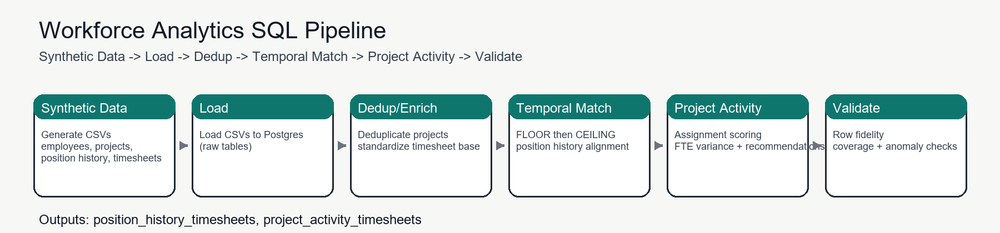
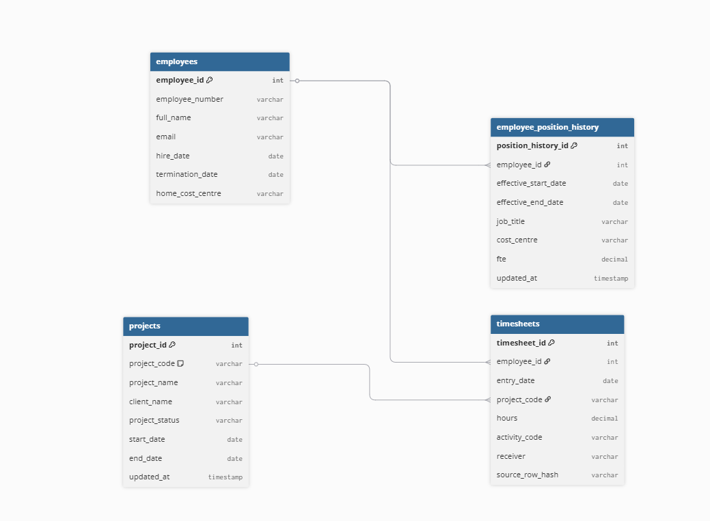
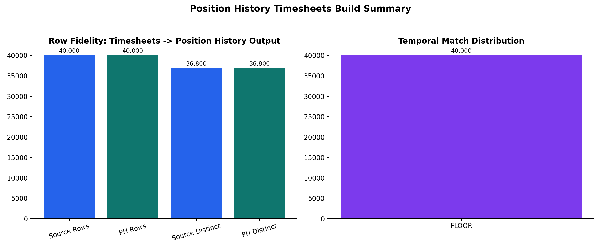
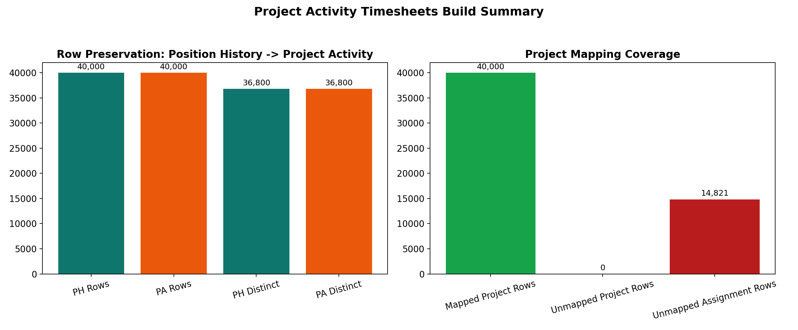
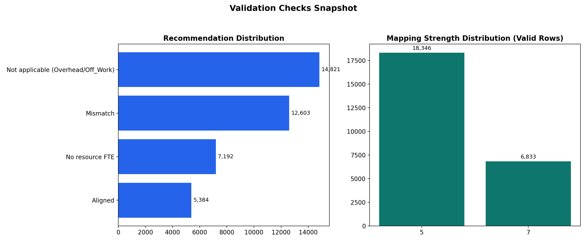
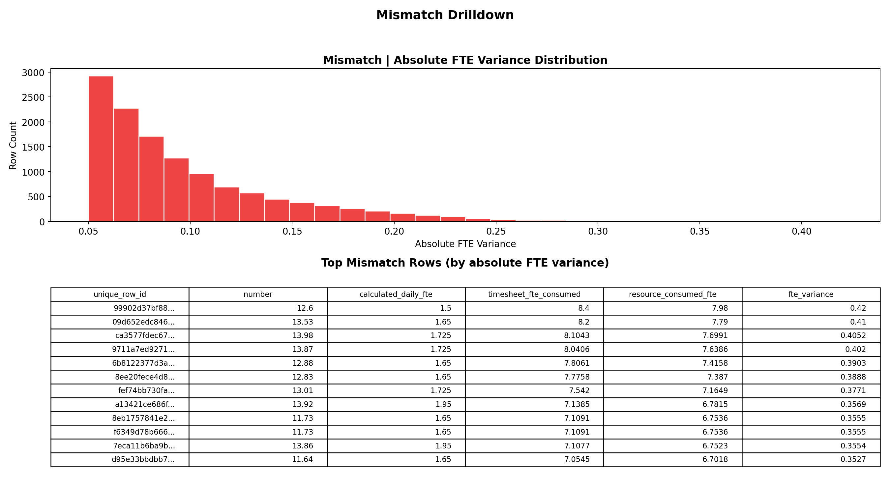
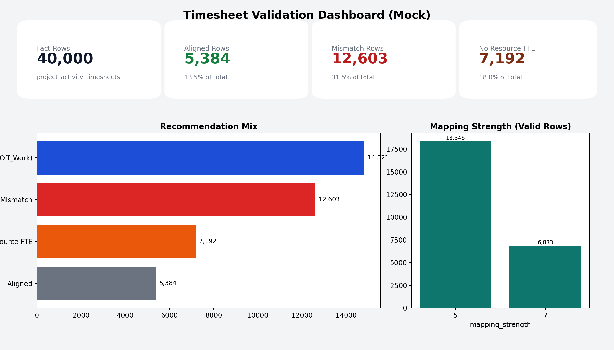

# Workforce Analytics SQL Pipeline

SQL-first portfolio project for a workforce analytics business case:
align each timesheet row to the correct historical employee position, then build a validated project activity fact table.

This repository demonstrates:
- Temporal matching logic (`FLOOR` then `CEILING`) using SQL window functions
- Deduplication and deterministic tie-breaking with `ROW_NUMBER()`
- Row-fidelity guarantees from raw timesheets to final outputs
- Practical validation patterns for business trust in labor reporting

## Business Value

When employees move between roles and cost centres, naive joins to "latest role" produce incorrect historical reporting.
This pipeline solves that by matching each timesheet entry to role context at the actual work date and validating the result quality.

## Core Outputs

- `position_history_timesheets`: timesheets enriched with temporal position context and FTE capacity metrics
- `project_activity_timesheets`: project activity fact table with assignment scoring, variance checks, and recommendations

## FTE Methodology (Key Business Logic)

This step is included and is central to the validation case.

1. Match each timesheet row to position history at the row date:
- Match on employee
- Prefer most recent prior effective record (`FLOOR`)
- If no prior record, use earliest future record (`CEILING`)

2. Pull the matched employee FTE from position history:
- `fte` comes from the matched position-history row (not from the timesheet input)

3. Calculate expected capacity from matched FTE:
- `calculated_daily_fte = daily_bookable_hours * fte`
- `calculated_weekly_fte = weekly_bookable_hours * fte`

4. Calculate consumed FTE and variance checks:
- `timesheet_fte_consumed = (hours / calculated_daily_fte) / dup_count` for valid work rows
- `fte_variance = timesheet_fte_consumed - resource_consumed_fte`
- Recommendation flags (`Aligned`, `Mismatch`, `No resource FTE`, `Not applicable`) are derived from this variance and match context.

## SQL Showcase Notebooks

Run these in order:
1. [05_sql_only_position_history_timesheets.ipynb](notebooks/05_sql_only_position_history_timesheets.ipynb)
2. [06_sql_only_project_activity_timesheets.ipynb](notebooks/06_sql_only_project_activity_timesheets.ipynb)

Both notebooks are SQL-only and include validations directly under build steps.

## Pipeline

`Synthetic Data -> Load -> Dedup -> Enrich -> Temporal Match -> Activity Mapping -> Validate`



## Data Model (ERD)

Entity relationship model for source and output tables:



## Visual Evidence

### Position History Build

`position_history_timesheets` build summary (row fidelity and temporal match distribution):



### Project Activity Build

`project_activity_timesheets` build summary (row preservation and project mapping coverage):



### Validation Snapshot

Recommendation and mapping-strength distributions from validation outputs:



### Mismatch Drilldown

Absolute FTE variance distribution and highest-variance rows:



### Dashboard Mock

Single-view KPI summary for stakeholder reporting:



## Quickstart

1. Create and activate a virtual environment.
2. Install notebook SQL dependencies:
```bash
python -m pip install jupysql ipython-sql sqlalchemy psycopg2-binary
```
3. Ensure Postgres is running and create database `workforce_analytics`.
4. Load CSV inputs from `data/synthetic` into Postgres tables:
- `employees`
- `employee_position_history`
- `projects`
- `timesheets`

You can load with pgAdmin Import/Export, or with your own SQL/ETL workflow.
5. Open and run notebook `05` top-to-bottom:
```bash
notebooks/05_sql_only_position_history_timesheets.ipynb
```
6. Open and run notebook `06` top-to-bottom:
```bash
notebooks/06_sql_only_project_activity_timesheets.ipynb
```

## Key Techniques

- Temporal candidate ranking with `ROW_NUMBER()` and explicit priority ordering
- Deterministic deduplication of project keys
- Hash-based row reconciliation to prove no row loss
- Coverage and anomaly checks for reporting confidence
- Recommendation flags (`Aligned`, `Mismatch`, `No resource FTE`, `Not applicable`)

## Example Validation Results

From a local run on March 1, 2026:
- `timesheets`: `40,000` rows
- `position_history_timesheets`: `40,000` rows
- `project_activity_timesheets`: `40,000` rows
- Distinct business row keys preserved across source and outputs: `36,800`

Recommendation split:
- `Not applicable (Overhead/Off_Work)`: `14,821`
- `Mismatch`: `12,603`
- `No resource FTE`: `7,192`
- `Aligned`: `5,384`

## Project Structure

- `notebooks`: SQL-only showcase notebooks
- `data/synthetic`: generated CSV inputs
- `diagrams`: ERD and pipeline visuals
- `docs`: business context, assumptions, data dictionary, validation strategy
